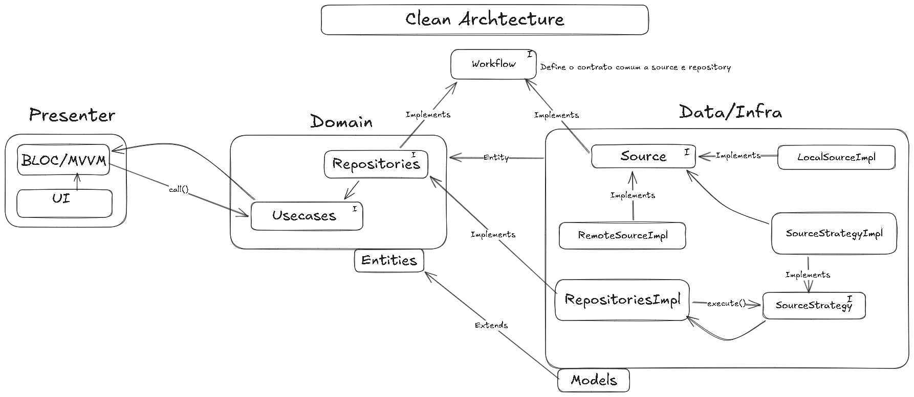
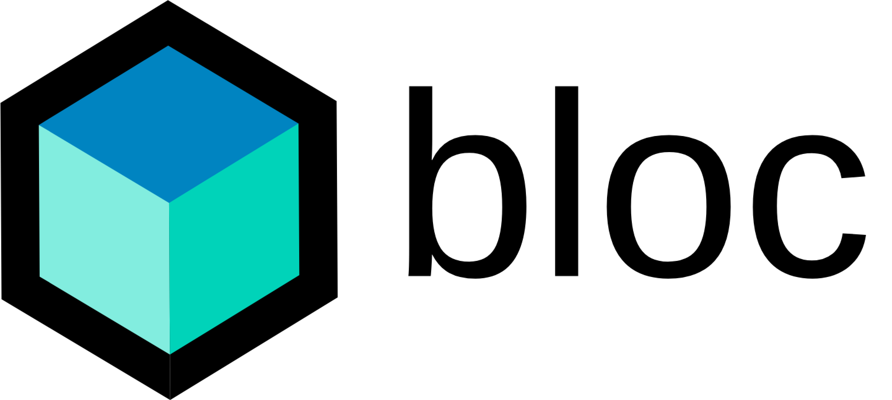
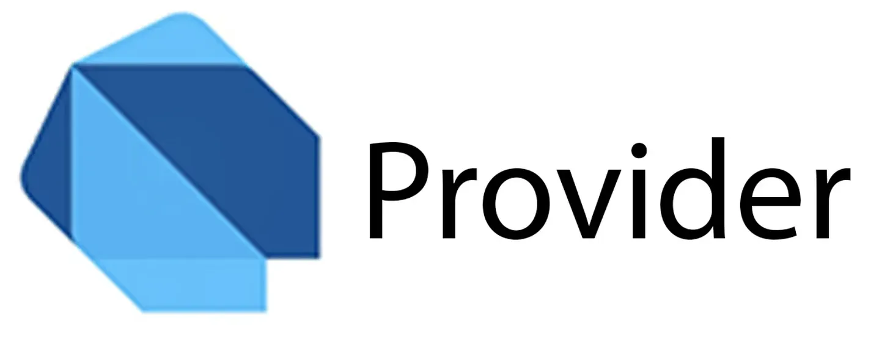
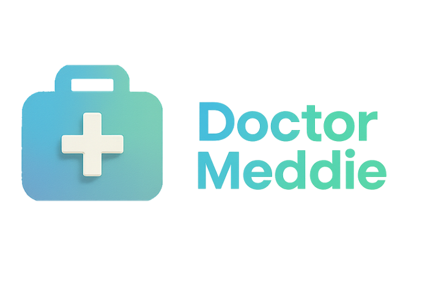

<h1>
  
</h1>

&nbsp;&nbsp;

&nbsp;&nbsp;

&nbsp;&nbsp;

&nbsp;&nbsp;

---

## Mobile Software Engineer

I am a Mid-Level Flutter Developer focused on building reliable Android and iOS applications. I work with technical leadership, scalable software architecture, automated testing, RESTful API integrations, and CI/CD, applying Clean Architecture and SOLID principles to production codebases.

**Current Focus:**
* Developing and evolving a Flutter product for **Doctor Meddie**, a US-based Healthtech, with architecture ownership, automated testing, RESTful API integrations, and mobile delivery pipelines.
* Leading the mobile development team at **STEM**, mentoring developers, conducting code reviews, and defining architecture and CI/CD standards.

**Technical Stack:**
* **Languages & Frameworks:** Flutter, Dart, Python, Django REST Framework.
* **Architecture & Testing:** Clean Architecture, SOLID, DDD, Unit, Widget, and End-to-End Testing.
* **State Management:** BLoC, Riverpod, Provider.
* **Backend & Cloud:** RESTful APIs, Firebase (Auth, Firestore, Cloud Functions), GCP.
* **Currently Studying:** Go, Gin, Docker, and AWS cloud services.

  
   
  Resume

## Core Tech Stack

### Mobile Engineering
&nbsp;&nbsp;
&nbsp;&nbsp;
&nbsp;&nbsp;

### Backend Engineering
&nbsp;&nbsp;
&nbsp;&nbsp;

### Data, Cloud & Delivery
&nbsp;&nbsp;
&nbsp;&nbsp;
&nbsp;&nbsp;
&nbsp;&nbsp;
&nbsp;&nbsp;

### Quality & Architecture
&nbsp;&nbsp;
&nbsp;&nbsp;
&nbsp;&nbsp;

 
Clean Architecture · SOLID · DDD · BLoC · Riverpod · Provider · Automated Testing

### Currently Learning
&nbsp;&nbsp;
&nbsp;&nbsp;
&nbsp;&nbsp;

AWS: SQS · Lambda · EC2 · S3 · Route 53 · Elastic Load Balancing

---

## Current Engineering Work

* **International Healthtech:** Architecture and feature development for a production Flutter application, with RESTful APIs, automated tests, native Android/iOS integrations, and CI/CD.
* **Mobile Technical Leadership:** Architecture definition, mentoring, code review, automated builds, and testing standards across STEM's mobile project portfolio.
* **Firebase-backed Products:** Authentication, real-time data, Cloud Functions, and reliable communication between Flutter applications and backend services.

## Academic Background

  

  <h3>Universidade do Estado do Rio de Janeiro — UERJ</h3>
  
Bachelor's Degree in Computer Science · 2022–2028 (in progress)

  <table>
    <tr>
      <td align="center"><strong>10.00</strong> Object-Oriented Programming I</td>
      <td align="center"><strong>7.00</strong> Object-Oriented Programming II</td>
      <td align="center"><strong>7.25</strong> Object-Oriented Programming III</td>
    </tr>
    <tr>
      <td align="center"><strong>8.50</strong> Algorithms & Data Structures I</td>
      <td align="center"><strong>8.75</strong> Algorithms & Data Structures II</td>
      <td align="center"><strong>7.44 / 10.00</strong> Cumulative GPA (CR)</td>
    </tr>
  </table>

  
   
  Academic Transcript

## Experience & Activities

  
<strong>Mid-Level Flutter Mobile Developer — Doctor Meddie</strong> (Mar/2026 - Present · Miami, FL · Remote)

   
  

    
  

   
  - Defined the Flutter architecture for Android and iOS using Clean Architecture and SOLID. 
  - Selected BLoC or Riverpod according to each feature's complexity and documented technical standards for the team. 
  - Structured unit, widget, and End-to-End automated test suites to prevent regressions. 
  - Built and maintained Codemagic and GitHub Actions pipelines for tests, builds, and store releases. 
  - Developed RESTful API integrations and mapped native Android and iOS capabilities for an international Healthtech product.

  
<strong>Head of Mobile Development — STEM Junior Company (UERJ)</strong> (Sep/2025 - Present)

   
  - Lead and mentor a mobile team of eight developers through code reviews and technical sessions. 
  - Established Clean Architecture and SOLID as shared engineering standards across the mobile portfolio. 
  - Define state-management strategies with Riverpod, BLoC, and Provider according to business complexity. 
  - Configure GitHub Actions pipelines for automated builds and tests on pull requests. 
  - Develop Firebase, Cloud Functions, and RESTful API integrations for external client projects.

  
<strong>Computer Architecture Teaching Assistant — UERJ</strong> (Apr/2024 - Present)

   
  - Support more than 40 students in a complex undergraduate Computer Architecture course. 
  - Develop Python scripts with Pandas, Matplotlib, and Seaborn to automate performance analysis. 
  - Work with faculty on teaching strategies that contributed to a 50% increase in the course approval rate.

  
<strong>Digital Security Instructor & Technical Writer</strong> (May/2025 - Apr/2026)

   
  - Created classes, technical articles, and educational material about digital security best practices. 
  - Adapted complex technical subjects for different audiences in a structured course format.

## GitHub Activity

  
  

  

  

  

---

## Certifications & Achievements

* **Aspire Leaders Program (2025):** Accepted into Cohort 4.
* **DIO Campus Experts Alumni:** Specific Applications Programming (Jun 2025 - Sep 2025).

  
  &nbsp;&nbsp;
  
  &nbsp;&nbsp;
  
  &nbsp;&nbsp;
  

---

## Social Media

  
  &nbsp;&nbsp;
  

  

